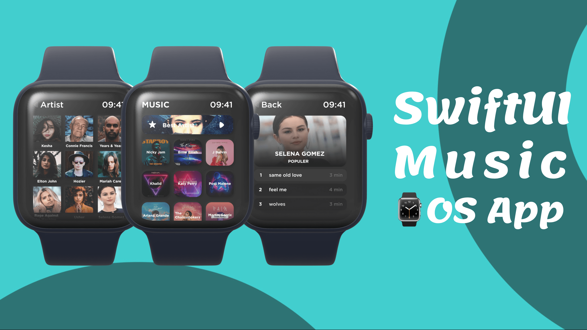

# Interface utilisateur de l'application musicale pour Apple Watch - SwiftUI

## [Regardez-le sur YouTube] (https://www.youtube.com/channel/UCpFAc6I0Rr8FrIEmwdMyg0w)

Nous créons trois écrans pour l'application musicale qui s'exécute sur votre montre Apple pour laquelle nous utilisons SwiftUI. Sur l'écran d'accueil, il affiche une bannière en haut, puis une grille d'artistes populaires. Ensuite, il y a un écran d'artiste où vous pouvez trouver votre artiste préféré. À la fin, nous créons un écran de chansons avec un travail pour les deux moyens pour n'importe quel artiste ou album.

### Music App UI pour Apple Watch Final UI

